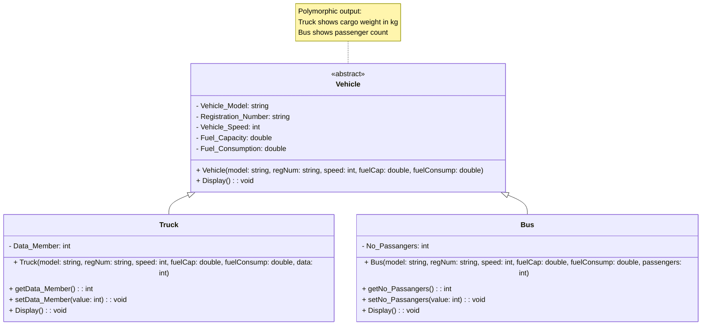

# C++ Programming Assignment 8 Solutions

## Overview

This repository contains solutions to Assignment 8, focusing on object-oriented programming concepts in C++. The assignment covers abstraction and polymorphism through class hierarchies and method overriding.

---

## Assignments

### 1. **Animal Class Hierarchy (Abstraction)**

* **Description**:
  Demonstrates abstraction using an abstract base class `Animal` and derived classes `Cat`, `Dog`, and `BigDog`.

  * **Abstract Class: `Animal`**
    * **Attributes**:
      * `name: string` (protected)
    * **Methods**:
      * Constructor: `Animal(string name)`
      * Pure Virtual Method: `greets(): void`

  * **Derived Class: `Cat`**
    * **Methods**:
      * Constructor: `Cat(string name)`
      * Overrides `greets()` to print `"Meow"`

  * **Derived Class: `Dog`**
    * **Methods**:
      * Constructor: `Dog(string name)`
      * Overrides `greets()` to print `"Woof"`
      * Overloaded Method: `greets(Dog another): void` prints `"Woooof"`

  * **Derived Class: `BigDog` (extends `Dog`)**
    * **Methods**:
      * Constructor: `BigDog(string name)`
      * Overrides `greets()` to print `"Wooow"`
      * Overrides `greets(Dog another): void` to print `"Woooooow"`
      * New Method: `greets(BigDog another): void` prints `"Wooooooooow"`

* **UML Diagram**:

```mermaid
classDiagram
    class Animal {
        <<abstract>>
        - name: string
        + Animal(name: string)
        + greets(): void
    }

    class Cat {
        + Cat(name: string)
        + greets(): void
    }

    class Dog {
        + Dog(name: string)
        + greets(): void
        + greets(another: Dog): void
    }

    class BigDog {
        + BigDog(name: string)
        + greets(): void
        + greets(another: Dog): void
        + greets(another: BigDog): void
    }

    Animal <|-- Cat
    Animal <|-- Dog
    Dog <|-- BigDog

    note for Animal "Polymorphic behavior:
Cat → 'Meow'
Dog → 'Woof'
BigDog → 'Wooow'
BigDog+Dog → 'Woooooow'
BigDog+BigDog → 'Wooooooooow'"

* **Example Outputs**:
  ```plaintext
  Cat: "Meow"
  Dog: "Woof"
  Dog greeting another Dog: "Woooof"
  BigDog: "Wooow"
  BigDog greeting Dog: "Woooooow"
  BigDog greeting BigDog: "Wooooooooow"
```

---

### 2. **Vehicle Class Hierarchy (Polymorphism)**

* **Description**:
  Demonstrates polymorphism using a base class `Vehicle` and derived classes `Truck` and `Bus`, each overriding the `Display()` method.

  * **Base Class: `Vehicle`**
    * **Attributes** (protected):
      * `Vehicle_Model: string`
      * `Registration_Number: string`
      * `Vehicle_Speed: int` (km/h)
      * `Fuel_Capacity: double` (liters)
      * `Fuel_Consumption: double` (liters/100km)
    * **Methods**:
      * Constructor: `Vehicle(model, regNum, speed, fuelCap, fuelConsump)`
      * Pure Virtual Method: `Display(): void`

  * **Derived Class: `Truck`**
    * **Additional Attribute**:
      * `Data_Member: int` (kg)
    * **Methods**:
      * Constructor: `Truck(model, regNum, speed, fuelCap, fuelConsump, data)`
      * Getter: `getData_Member(): int`
      * Setter: `setData_Member(int): void`
      * Overrides `Display()` to show truck details including cargo weight

  * **Derived Class: `Bus`**
    * **Additional Attribute**:
      * `No_Passangers: int`
    * **Methods**:
      * Constructor: `Bus(model, regNum, speed, fuelCap, fuelConsump, passengers)`
      * Getter: `getNo_Passangers(): int`
      * Setter: `setNo_Passangers(int): void`
      * Overrides `Display()` to show bus details including passenger count

* **UML Diagram**:



* **Example Outputs**:
  ```plaintext
  Truck Display:
  Vehicle Model: Volvo
  Registration Number: TR123
  Vehicle Speed: 90 km/h
  Fuel Capacity: 500 liters
  Fuel Consumption: 30 l/100km
  Data Member of truck: 777 Kg

  Bus Display:
  Vehicle Model: Mercedes
  Registration Number: BS456
  Vehicle Speed: 80 km/h
  Fuel Capacity: 300 liters
  Fuel Consumption: 25 l/100km
  Passengers of bus: 45 Persons
  ```

---

## How to Run the Programs

1. Compile the C++ files using a compiler like `g++`:
   ```bash
   g++ main.cpp -o assignment8
   ```
2. Execute the binary:
   ```bash
   ./assignment8
   ```

## Testing
* Instantiate objects of each class and call their methods to verify outputs.
* Example test cases:
  ```cpp
  // Test Animal hierarchy
  Cat cat("Whiskers");
  cat.greets();  // Output: "Meow"

  // Test Vehicle hierarchy
  Truck truck("Volvo", "TR123", 90, 500, 30, 777);
  truck.Display();  // Outputs truck details
  ```

## How to Contribute
1. Fork the repository.
2. Create a feature branch (`git checkout -b feature/your-feature`).
3. Commit changes (`git commit -m 'Add your feature'`).
4. Push to the branch (`git push origin feature/your-feature`).
5. Open a Pull Request.

## License
MIT License.
